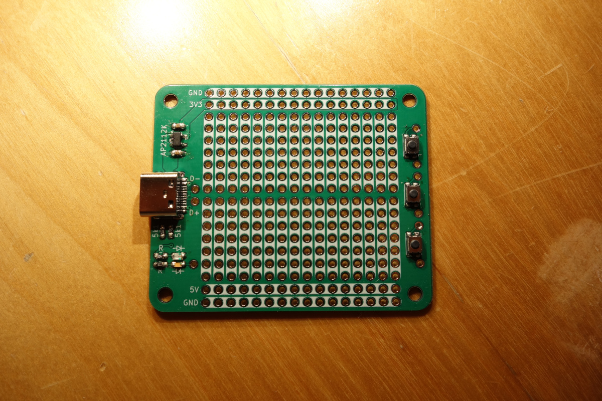

# An USB-C Fed Protoboard

This repository contains the [KiCAD]() and [OpenSCAD]() files for an USB-C fed
protoboard. The protoboard contains a 5V and 3V3 rail. Some extras are also
on the board such as a few LEDs and switches.
