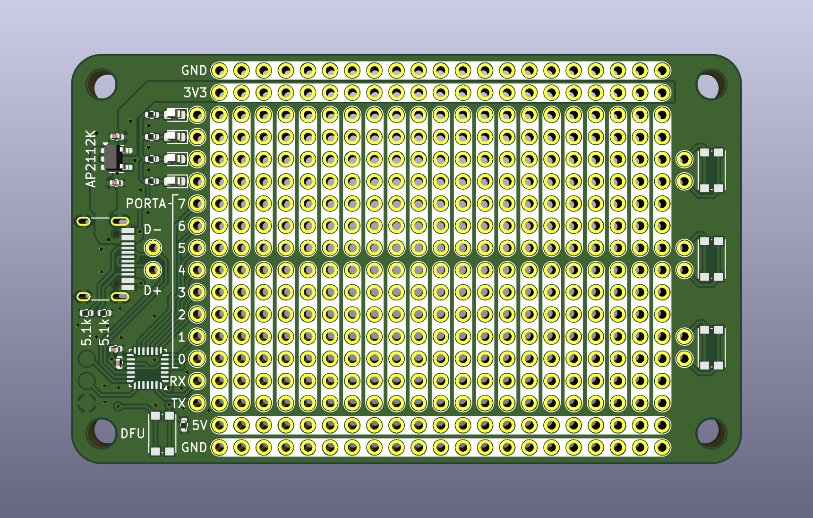

# A USB-C Fed Protoboard

This repository contains the [KiCAD]() and [OpenSCAD]() files for a USB-C fed
protoboard. The protoboard contains a 5V and 3V3 rail. Some extras are also
on the board such as a few LEDs and switches.

# A USB-C connected protoboard with programmable USB connectivity

A second version has an onboard STM32F042 to act for example as a USB-serial device,
or an HID keyboard.

