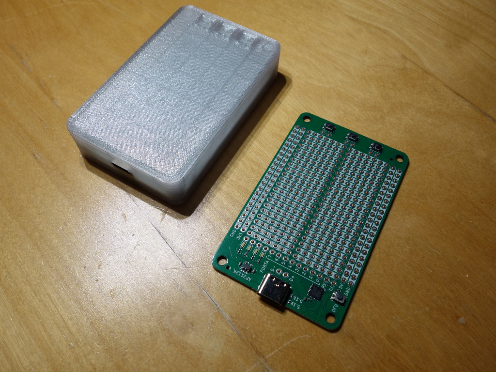
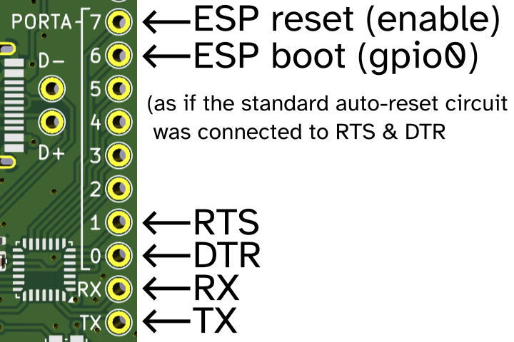
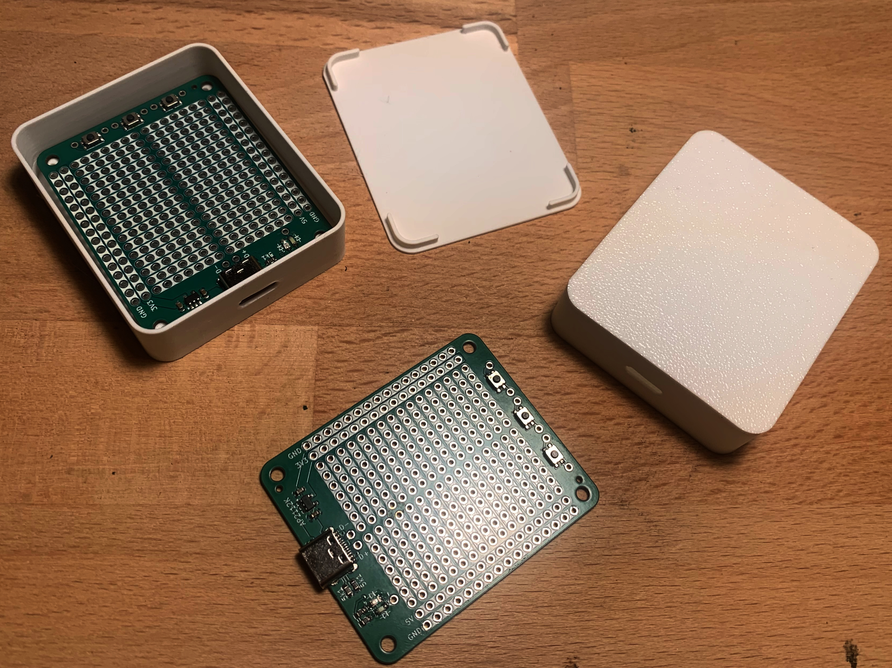

# A USB-C connected protoboard with programmable USB connectivity

A second version has an onboard STM32F042 to act for example as a USB-serial device,
or an HID keyboard.

# Firmware (still untested!)

* [usb_serial](firmware/usb_serial)
  

# License

* The hardware (schematic / PCB / production files / case models ) is Licensed CC-BY-4.0
* The firmware (in the firmware directory) uses libopencm3 which is licensed LGPLv3 and
  all code specific to this project is distributed under the MIT license.

# (old) USB-C Fed Protoboard

This repository contains the [KiCAD]() and [OpenSCAD]() files for a USB-C fed
protoboard. The protoboard contains a 5V and 3V3 rail. Some extras are also
on the board such as a few LEDs and switches.

