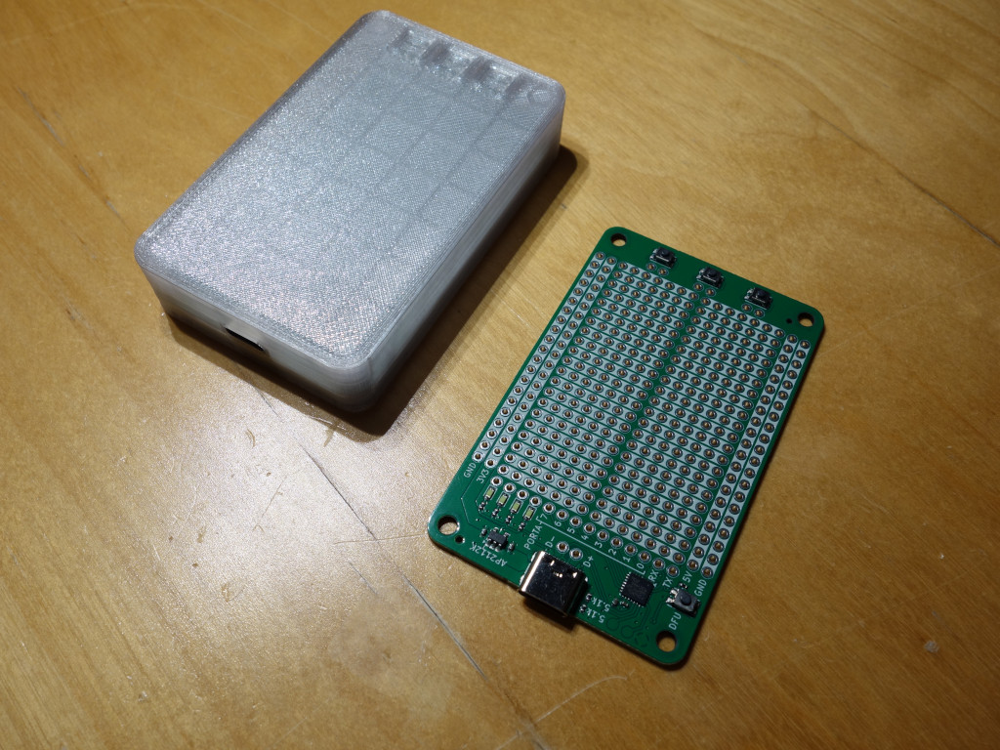
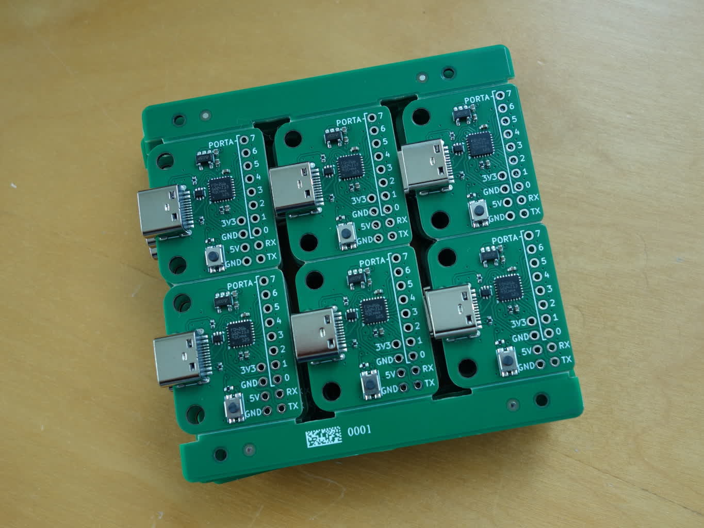

# USB-C powered boards with programmable USB connectivity

This repository contains a few boards aimed at rapid prototyping.

The main idea is to save time by providing often-used components
and a microcontroller that can act as a USB-serial to UART
(usb-cdc-acm) device, a HID keyboard/keypad or run other simple
programs.

# PCBs

## A protoboard with an STM32F042 for usb connectivity & GPIO / UART functionality.

Production files (JLCPCB): [gerbers](build/usb_proto/gerbers_jlc.zip) [BOM](build/usb_proto/bomfile_jlc.csv) [POS](build/usb_proto/posfile_jlc.csv)

Cases: [basic](build/usb_proto/case.stl) [hexagon](build/usb_proto/case_almost_regular_hexagon.stl) [keyswitches](build/usb_proto/case_keyswitches_8.stl) [led strips](build/usb_proto/case_led_strip_connector.stl)

* 5v USB-C fed (with 5k1 resistors for true USB-C compatibility)
* 3v3 linear regulator
* STM32F042G6 microcontroller (with xtal-less 12mbit USB support)
* A button to boot the STM32 in DFU mode
* GPIO Port A pins 0 to 7 broken out
* GPIO Port B pins 6 & 7 broken out (for UART TX/RX)
* 4 general purpose LEDs
* 3 general purpose buttons
* A 21 column breadboard-style protoboard
* size: 47x77mm
* 4 M3 holes 40mm and 70mm apart

## An STM32F042 breakout board

Production files (JLCPCB): [gerbers](build/usb_mini_io/gerbers_jlc.zip) [BOM](build/usb_mini_io/bomfile_jlc.csv) [POS](build/usb_mini_io/posfile_jlc.csv)

Cases: [keypad (keycaps flush)](build/usb_mini_io/keypad.stl) [keypad (keyswitches visible)](build/usb_mini_io/old_keypad.stl) [single key controller](build/usb_mini_io/single_key.stl)

* for smaller enclosures (27x22mm)
* I/O & firmware compatible with the protoboard
* 5v USB-C fed (with 5k1 resistors for true USB-C compatibility)
* 3v3 linear regulator
* STM32F042G6 microcontroller (with xtal-less 12mbit USB support)
* A button to boot the STM32 in DFU mode
* no LEDs / general purpose buttons / protoboard space
* 2 M3 holes 20mm apart

## (old) USB-C Fed Protoboard

The first version of the protoboard did not have a microcontroller:
[pcb/simple](pcb/simple)

# Firmware (seems to work, no guarantees!)

* [usb_serial](firmware/usb_serial) USB serial to UART adapter firmware, with RTS/DTR signals & reset/boot signals for directly programming ESP32s.
* [usb_hid_keymatrix](firmware/usb_hid_keymatrix) USB HID Keypad firmware, for a keyboard matrix
* [usb_hid_simple](firmware/usb_hid_simple) USB HID Keypad firmware for a few buttons
* [flappy](firmware/flappy) Flappy bird controller / spacebar only USB HID Keypad
* [game_controller](firmware/game_controller) Gamepad controller / USB HID Keypad
* [popcalc](firmware/popcalc) USB device that 'pops calc'
* [led_segment_tester](firmware/led_segment_tester) tester firmware for a LED installation
* [obegraensad](firmware/obegraensad) USB-serial to 16 bit IKEA OBEGRÄNSAD display driver

# License

* The hardware (schematic / PCB / production files / case models ) is Licensed CC-BY-4.0
* The firmware (in the firmware directory) uses libopencm3 which is licensed LGPLv3 and
  all code specific to this project is distributed under the MIT license.
* This repo contains nothing vibe-coded
* LLM assisted contributions not welcome

