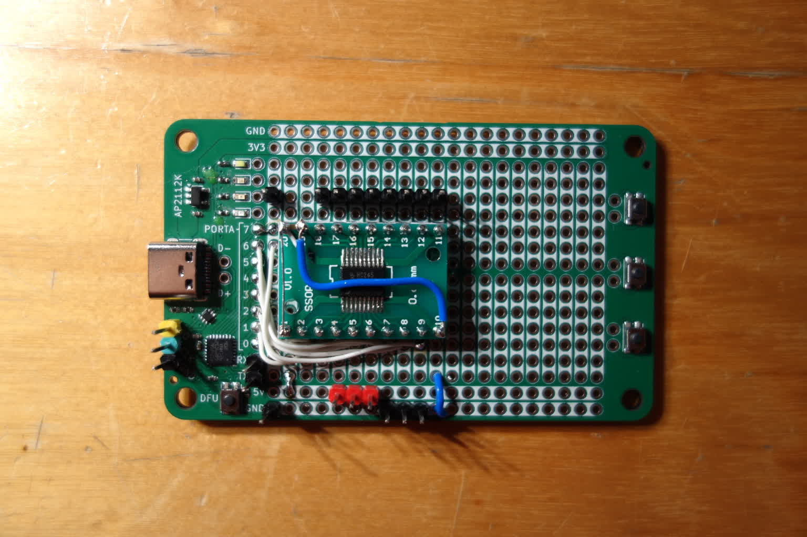

# IKEA OBEGRÄNSAD driver directly from USB-serial, untested


Driver side identical to: [brainsmoke/esp32leddriver/.../obegraensad](https://github.com/brainsmoke/esp32leddriver/tree/master/firmware/stm32/obegraensad)

## Pinout:


(Picture does not show 5V and ground connections)

Output, boosted to 5V signalling:

* PA0: Data in, top panel
* PA1: Data in, 2nd panel
* PA2: Data in, 3rd panel
* PA3: Data in, bottom panel
* PA4: Clock (wired to bottom panel)
* PA5: Latch (wired to bottom panel)
* PA6: Not Output Enable (wired to bottom panel)

Input:

* PA7: Button (pulls to ground when pressed.)

Power:

* Ground (always required as to not create floating signal lines
* 5V, in case you feed the panel through the proto-board

## Proto-board with 5V level shifting on the outputs:



## Protocol over USB-serial (usb-cdc-acm):

Sending a frame: `( [16 bit brightness]*256 [ FF FF FF F0 ] )*`

Brightness must be little endian integers in the (inclusive) range `[0 .. 0xFF00]`

One brightness value per pixel. Pixels are addressed left to right, top to bottom.

`[ FF FF FF F0 ]` is an end of frame marker and allows the protocol to synchronize
in the event of an uneven number of bytes being written to the serial port


Programming:

```
git submodule init
git submodule update
make -C ../libopencm3/ # if not done already
make

# using DFU
# push DFU boot button while inserting the device
make dfu_flash

# using black magic probe:

gdb-multiarch obegraensad.elf
set mem inaccessible-by-default off
set confirm off
target extended-remote /dev/ttyACM0
monitor swdp_scan
attach 1
load
run
```

