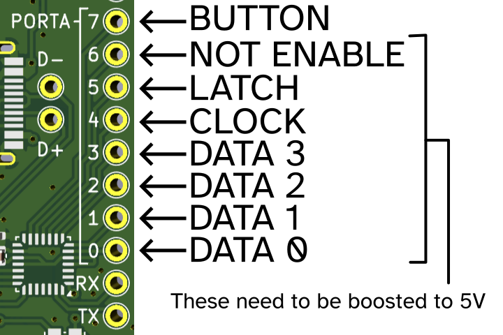

# IKEA OBEGRÄNSAD driver directly from USB-serial, untested


Driver side identical to: [brainsmoke/esp32leddriver/.../obegraensad](https://github.com/brainsmoke/esp32leddriver/tree/master/firmware/stm32/obegraensad)



Outputs have to be boosted to 5V.
The side-button pulls to ground when pressed.

```
git submodule init
git submodule update
make -C ../libopencm3/ # if not done already
make

# using DFU
# push DFU boot button while inserting the device
make dfu_flash

# using black magic probe:

gdb-multiarch obegraensad.elf
set mem inaccessible-by-default off
set confirm off
target extended-remote /dev/ttyACM0
monitor swdp_scan
attach 1
load
run
```

