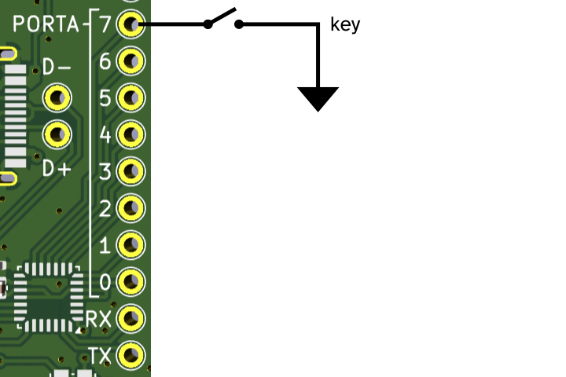

# USB device that 'pops calc' on many systems


# schematic



# 3D printed case:

[single key controller](/build/usb_proto/single_key.stl)

# build instructions

Edit keys in `main.c`

```
git submodule init
git submodule update
make -C ../libopencm3/ # if not done already
make


# using DFU
# push DFU boot button while inserting the device
make dfu_flash

# using black magic probe:

gdb-multiarch usb_hid_keypad.elf
set mem inaccessible-by-default off
set confirm off
target extended-remote /dev/ttyACM0
monitor swdp_scan
attach 1
load
run
```

