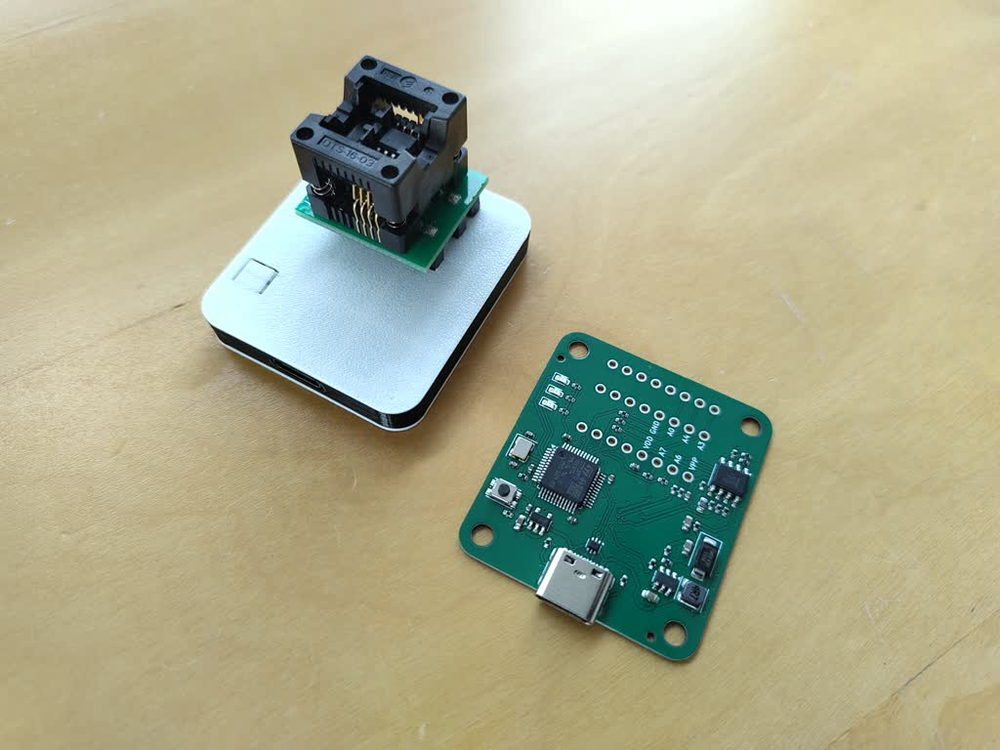

# Padauk programmer with USB-C connector

Production files (JLCPCB): [gerbers](../../build/pdk_prog/gerbers_jlc.zip) [BOM](../../build/pdk_prog/bomfile_jlc.csv) [POS](../../build/pdk_prog/posfile_jlc.csv)

Case: [case](../../build/pdk_prog/case.stl)

Circuit adapted from:

  https://github.com/free-pdk/easy-pdk-programmer-lite-hardware

Which in turn was adapted from:

  https://github.com/free-pdk/easy-pdk-programmer-hardware

Runs:

  https://github.com/free-pdk/easy-pdk-programmer-software
