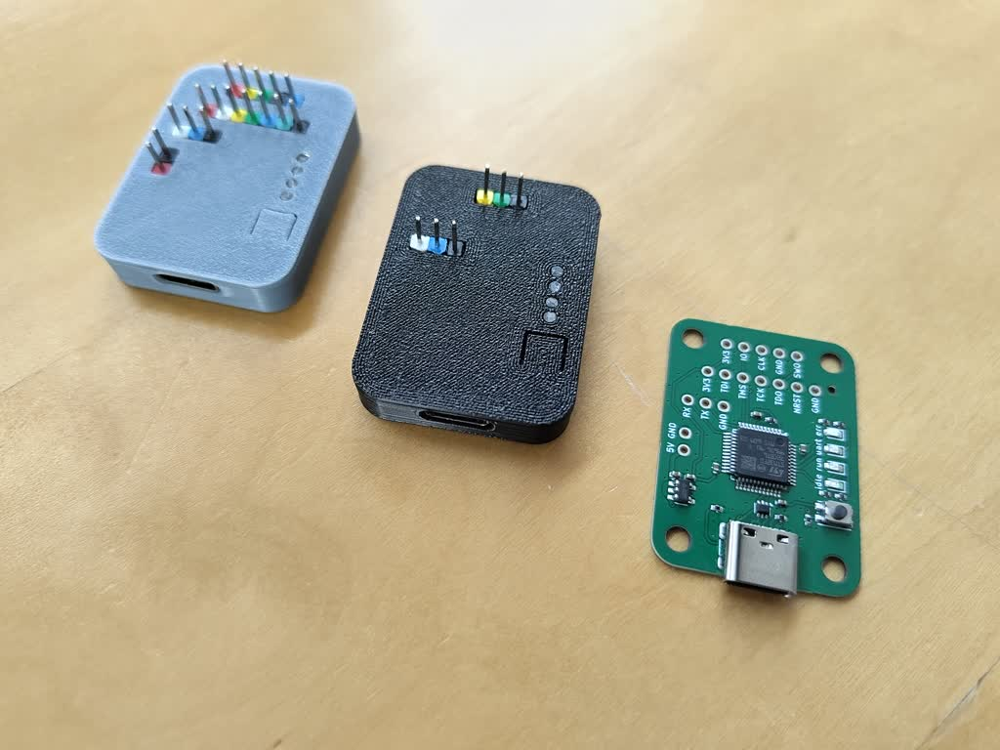

# JTAG/SWD programmer with USB-C connector

Production files (JLCPCB): [gerbers](../../build/swd_prog/gerbers_jlc.zip) [BOM](../../build/swd_prog/bomfile_jlc.csv) [POS](../../build/swd_prog/posfile_jlc.csv)

Cases: [basic](../../build/swd_prog/case.stl), [all headers](../../build/swd_prog/case_all.stl)

